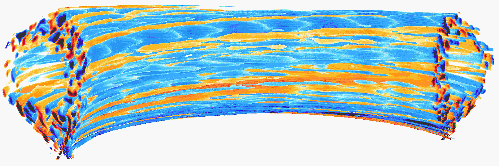

### Welcome to the FELTOR project!

#### 1. License 
FELTOR is free software and licensed under the very permissive MIT license. It was originally developed by Matthias Wiesenberger and Markus Held.

#### 2. Quick start guide
1. Go ahead and clone our library in any folder you like 
`$ git clone https://www.github.com/feltor-dev/feltor`
 
2. You also need to clone  [thrust]( https://github.com/thrust/thrust) and [cusp](https://github.com/cusplibrary/cusplibrary) distributed under the Apache-2.0 license. 
    > Our code only depends on external libraries that are themselves openly available. We note here that we do not distribute copies of these libraries.

    So again
    `$ git clone https://www.github.com/thrust/thrust`
    `$ git clone https://www.github.com/cusplibrary/cusplibrary`

3. Now you need to tell the feltor configuration where these external libraries are located on your computer. The easiest way to do this is to go in your `HOME` directory and 
   `$ mkdir include`
    `$ cd include`
    `$ ln -s path/to/thrust thrust`
    `$ ln -s path/to/cusp cusp` 
  If you do not like this, you can also create your own config file as discribed [here](https://github.com/feltor-dev/feltor /wiki/Configuration).

4. Now let us compile the first benchmark program. 
    > The minimum requirement to compile and run an application is a working C++ compiler (g++ per default) and a CPU. We don't use new C++-11 standard features to avoid complications since some clusters are a bit behind on up-to-date compilers. Our GPU backend uses the [Nvidia-CUDA](https://developer.nvidia.com/cuda-zone) programming environment and in order to compile and run a program for a GPU a user needs the nvcc CUDA compiler (available free of charge) and a NVidia GPU. However, we explicitly note here that due to the modular design of our software a user does not have to possess a GPU nor the nvcc compiler. The CPU version of the backend is equally valid and provides the same functionality. 

     Go to 
 `$ cd path/to/feltor/inc/dg`
 and type 
 `make blas_b device=omp` (for an OpenMP version)
 or
 `make blas_b device=gpu` (if you have a gpu and nvcc )
    >To simplify the compilation process we use the GNU Make utility, a standard build automation tool that automatically builds the executable program. 

5. Run the code with
`$ ./blas_b `
and when prompted for input vector sizes type for example
`3 100 100 10`
which makes a grid with 3 polynomial coefficients, 100 cells in x, 100 cells in y and 10 in z. 
    >Go ahead and play around and see what happens. You can compile and run any other program that ends in `_t.cu` or `_b.cu` in `feltor/inc/dg` in this way. 

6. Now let us test the mpi setup (you can of course skip this if you don't have mpi installed on your computer
    > If the user intends to use the MPI backend, an implementation library of the mpi standard is required.

    Go to 
 `$ cd path/to/feltor/inc/dg`
 and type 
 `make blas_mpib device=omp` (for MPI+OpenMP)
 or
 `make blas_mpib device=gpu` (for MPI+GPU)
Run the code with
`$ mpirun -n '# of procs' ./blas_mpib `
then tell how many process you want to use in the x-, y- and z- direction, for example:
`2 2 1` (i.e. 2 procs in x, 2 procs in y and 1 in z; total number of procs is 4)
when prompted for input vector sizes type for example
`3 100 100 10` (number of cells divided by number of procs must be an integer number)

7. Now, we want to compile a simulation program. First, we have to download and install some libraries for I/O-operations.
    > For data output we use the [NetCDF](http://www.unidata.ucar.edu/software/netcdf/) library under an MIT - like license. The underlying [HDF5](https://www.hdfgroup.org/HDF5/) library also uses a very permissive license.  
Our JSON input files are parsed by [JsonCpp](https://www.github.com/open-source-parsers/jsoncpp) distributed under the MIT license (the 0.y.x branch to avoid C++-11 support).
Some rendering applications in FELTOR use the [draw library]( https://github.com/mwiesenberger/draw) (developed by us also under MIT), which depends on OpenGL (s.a. [installation guide](http://en.wikibooks.org/wiki/OpenGL_Programming)) and [glfw](http://www.glfw.org), an OpenGL development library under a BSD-like license.
 The documentation can be generated with [Doxygen](http://www.doxygen.org) from source code.  Note that for the mpi versions of applications you need to build hdf5 and netcdf with the --enable-parallel flag. Do NOT use the pnetcdf library, which uses the classic netcdf file format.  The OpenMP standard is natively supported by most recent C++ compilers.
 
	As in Step 3 you need to create links to the draw and the jsoncpp library in your include folder or provide the paths in your config file 
8. Now, go to 
`$ cd path/to/feltor/src/toefl`
and type
`make toeflR device=gpu` (for a live simulation on gpu with glfw output)
or
`make toefl_hpc device=gpu` (for a simulation on gpu with output stored to disc)
or
`make toefl_mpi device=omp` (for an mpi simulation with output stored to disc)
A default input file is located in `path/to/feltor/src/toefl/input`
    >The mpi program will wait for you to type the nmber of processes in x and y direction before starting

#### 3. Further reading
Please check out our [Wiki pages](https://github.com/feltor-dev/feltor/wiki) for some general information and user oriented documentation. The [developer oriented documentation](http://feltor-dev.github.io/feltor/inc/dg/html/modules.html) is generated with Doxygen from source code.

#### 4. Official releases 
Our latest code release has a shiny DOI badge from zenodo

which makes us officially citable.

